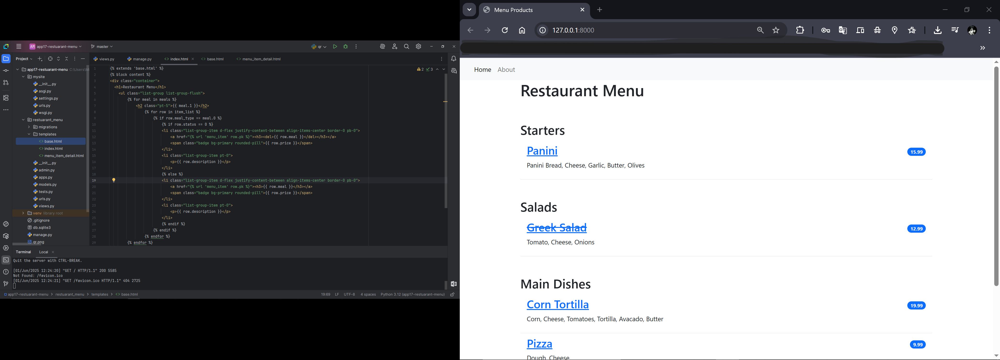

# 🍽️ Restaurant Menu - Django Web Application

A Django-based web application for showcasing a restaurant's menu. It supports listing meals categorized by type, detailed item views, and admin interface for content management.

---

## Features

- Home page with categorized meals using Django's class-based views.
- Detailed page for each menu item with description and price.
- Meals marked unavailable are shown with a strike-through.
- Admin panel integration for managing menu items.
- QR code generation linking to the website (basic example).

---

## Tech Stack

- **Backend:** Django 5.x (Python)
- **Frontend:** Bootstrap 5
- **Database:** SQLite (default for development)
- **QR Code:** Python `qrcode` library

---

## Preview



---

## Project Structure

```bash
restaurant_menu/
├── restaurant_menu/
│   ├── migrations/
│   ├── templates/
│   │   ├── about.html
│   │   ├── base.html
│   │   ├── index.html
│   │   └── menu_item_detail.html
│   ├── __init__.py
│   ├── admin.py
│   ├── apps.py
│   ├── forms.py
│   ├── models.py
│   ├── tests.py
│   ├── urls.py
│   └── views.py
├── mysite/
│   ├── __init__.py
│   ├── settings.py
│   ├── urls.py
│   ├── wsgi.py
│   └── asgi.py
├── db.sqlite3
├── manage.py
├── qr.py
├── .gitignore
└── README.md

```


## Getting Started
### 1. Clone the repository

```bash

git clone https://github.com/mihirpatil37/Restaurant_Menu_App.git
cd restaurant_menu

```


### 2. Create a virtual environment & activate

```bash

python -m venv env
# Windows:
env\Scripts\activate
```


### 3. Install dependencies

```bash

pip install -r requirements.txt
```
Or manually:
```bash

pip install django qrcode
```
### 4. Run migrations
```bash
python manage.py migrate
```
### 5. Create a superuser (for admin panel)
```bash
python manage.py createsuperuser
```
### 6. Start development server
```bash
python manage.py runserver
Visit http://127.0.0.1:8000/ to view the menu.
```
## QR Code
Run the following script to generate a QR code that links to your local site:
```bash
 qr.py
```
It will generate a qr.png file.
## Admin Panel
Access the Django admin at:
arduino
```bash
http://127.0.0.1:8000/admin/
```

Manage all your menu items with filtering and search functionality.

## License
This project is licensed under the MIT License.

## Author
Mihir Patil
